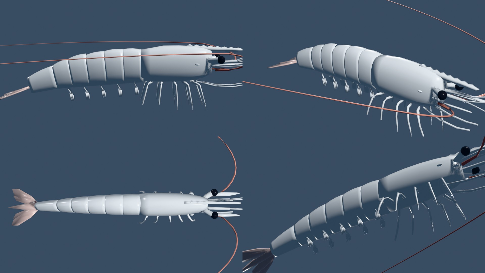

# Lista de verificación anatómica: *Litopenaeus vannamei* (camarón blanco del Pacífico)

Es el modelo 3D de la previs, hecho en Higgsfield 3D Jutsu (proyecto `ea6989d5-d5b5-4049-80fc-fbf854d815c7`, colección `SHRIMP_Anatomy`).
Le pedimos a I+D o al equipo técnico de BioMar que marque cada punto (✅ correcto, ✏️ corregir) antes del render final.

Medida del modelo: unos 13 cm de largo total, de la punta del rostro a la punta del telson. Es un camarón de engorde en estanque.

## Cefalotórax
| Estructura | Cómo está en el modelo | Revisión |
|---|---|---|
| Caparazón | Comprimido a los lados, con quilla dorsal (carena adrostral) que se continúa en el rostro; equivale a ~28 % del largo total | |
| Rostro | Lámina comprimida a los lados, con **8 dientes dorsales y 2 ventrales**; llega apenas más allá del pedúnculo de las anténulas | |
| Espinas | Espina hepática y espina antenal, chicas, a cada lado | |
| Ojos | Pedunculados, en el borde anterior del caparazón y a los costados de la base del rostro; córnea oscura | |
| Anténulas (1.er par) | Pedúnculo y **dos flagelos cortos** de cada lado | |
| Escafocerito | Escama antenal plana, al costado del rostro | |
| Antenas (2.º par) | Flagelos rojizos muy largos (~1,5 veces el cuerpo) que salen por debajo de los ojos y se curvan hacia atrás por los flancos | |
| Tercer maxilípedo | Delgado, llevado hacia adelante bajo la cabeza | |
| Pereiópodos (patas caminadoras) | **5 pares**; **P1 a P3 con pinza (quelados)**, P3 el más largo; P4 y P5 simples; bajo el cuerpo, con las puntas apoyadas en el fondo | |

## Abdomen
| Estructura | Cómo está en el modelo | Revisión |
|---|---|---|
| Somitos | **6**, comprimidos a los lados, con pleuras; el **6.º es el más largo** (~1,5 veces el 5.º) | |
| Carena dorsal | En los somitos 4 a 6 | |
| Pleópodos | **5 pares** (somitos 1 a 5), birrámeos, finos y con flecos, algo translúcidos | |
| Postura en reposo | Abdomen apenas arqueado hacia abajo (flexión ventral leve) | |

## Abanico caudal
| Estructura | Cómo está en el modelo | Revisión |
|---|---|---|
| Telson | En punta, con surco dorsal | |
| Urópodos | Un par, cada uno con endopodito y exopodito; bordes rojizos o castaños | |

## Color y material (previs)
- Cuerpo blanco-gris translúcido.
- Antenas rojizas.
- Abanico caudal rosado o castaño.

En el render final se puede sumar el leve tono azulado y los cromatóforos.

## Vistas del modelo

Las vistas son lateral, tres cuartos, superior y desde abajo. El script que construye el modelo es `build_shrimp.py` y corre en Blender dentro de 3D Jutsu.

## Puntos que conviene que revise un especialista
- Proporciones del caparazón respecto del abdomen, y largo del rostro.
- Largo relativo de los pereiópodos (P3 el más largo) y tamaño de las pinzas de P1 a P3, que hoy son muy chicas.
- Tamaño de los ojos: puede que estén algo grandes.
- Haz de anténulas, escafocerito y tercer maxilípedo delante de la cabeza: hoy se lee como un conjunto de varillas.
- Largo de las antenas (2.º par) y cómo van en reposo y en movimiento.

## Comportamiento animado (resumen)
- **En ayunas:** quietos en el fondo, con algún paso lento de vez en cuando. Dos camarones escapan con un coletazo hacia atrás cuando suena la alarma.
- **Al llegar el alimento:**
  - Caminan en zigzag guiándose por el olfato (quimiorrecepción) y dan saltitos nadando cuando la distancia es larga.
  - Se detienen con la cabeza hacia abajo, llevan las primeras patas a la boca y el pellet se achica mientras lo comen.
- **Cardúmenes:** nadan alineados con la dirección del grupo.
- **Superposiciones:** el cuerpo de cada camarón se modela como una cápsula del rostro al telson, y las colisiones se resuelven en cada fotograma. Auditoría independiente sobre el GLB exportado: **0 superposiciones en 360 fotogramas** (separación mínima 1,44 veces la distancia de contacto).
